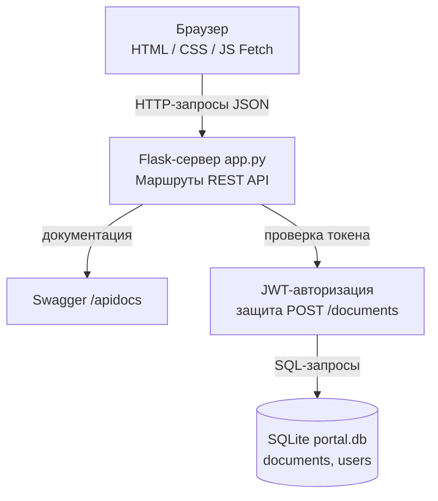
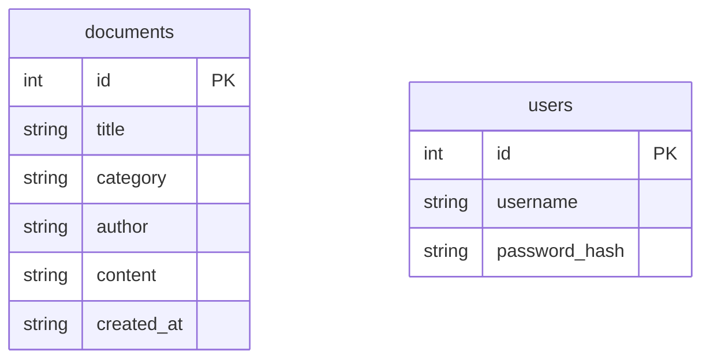

# Диаграммы проекта

## Архитектура

Как устроено приложение: браузер делает запросы к Flask, тот проверяет JWT-токен
для защищённых операций и работает с базой SQLite. Swagger документирует API.

## Схема базы данных

Две таблицы: документы и пользователи (для авторизации).

